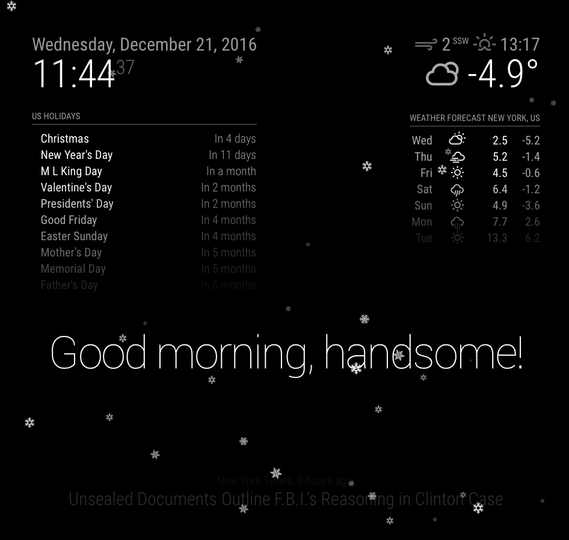
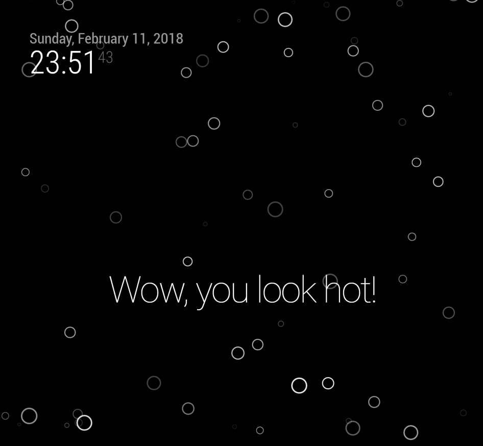

# Module: MMM-Snow
Inspired by [NHubbard's Snow Plugin](https://github.com/nhubbard/MagicPlugins/tree/master/snow) I created a little more realistic snow plugin to improve your winter experience! 

The module supports themes. Current themes are *winter* and *love*. The first one let's it snow while the latter conjurs hearts on your mirror.  

**Screenshot theme "winter"**



**Screenshot theme "love"**


**Screenshot theme "water"**



## Installation

In your terminal, go to your MagicMirror's Module folder:
````
cd ~/MagicMirror/modules
````

Clone this repository:
````
git clone https://github.com/MichMich/MMM-Snow.git
````

Configure the module in your `config.js` file.

**Note:** After starting the Mirror, it will take a few seconds before the snow begins to fall ...

## Using the module

To use this module, add it to the modules array in the `config/config.js` file:
````javascript
modules: [
	{
		module: 'MMM-Snow',
		position: 'fullscreen_above',
		config: { // See 'Configuration options' for more information.
			flakeCount: 100,
			theme: "winter"			
		}
	}
]
````

## Configuration options

The following property can be configured:


|Option|Description|
|---|---|
|`flakeCount`|The number of snow flakes. More flakes are havier for the cpu, so don't go wild. <br>**Default value:** `100`|
|`theme`| Defines the type of "flakes". Possible values are `winter`, `love`, and `water`.<br>**Default value:** `winter`|

## Defineing new themes

Certainly, there are many opportunities for new themes. To extend this module with new themes takes three simple development steps.

### Add image files
Add your "flake" images to folder `./images` in `MMM-Snow`directory. The image has to be a PNG with transparent background color. Make size of the file similar to existing files (50x50). The file names have to have a prefix followed by a number, e.g. `foo1.png`, `foo2.png`, `foo3.png`.

### Reference images in CSS classes
Create new CSS classes in `MMM-Snow.css`, which reference your images. Class name and file name n´have to be identical. 
````css
.MMM-Snow .foo1 {background-image: url('images/foo1.png');}
.MMM-Snow .foo2 {background-image: url('images/foo2.png');}
````

### Define theme
Extend the `themes` map in the file `MMM-Snow.js`. Just add another entry   
````javascript
"bar"   : { 
	"flakePrefix" : "foo",    
	"imagesCount"  : 3,         // number of images in this theme, here:  foo1, foo2, foo3
	"downwards"    : false,     // flakes move upwards from bottom to top
	"sizeFactor"   : 2}         // adapt size of flakes to your liking, <1 smaller, =1 original, >1 larger 
````
The named index `bar` is the externally visible theme name, which has to be used in `config.js`. Setting `flakePrefix` tells how the image files and CSS classes are called; in our example it should be `foo`. `imagesCount` defines how many image files / css classes are there. If you have three images, put `3` which makes the module using `foo1`, `foo2`, and `foo3` respectively. The boolean setting `downwards` defines the direction of flakes' movements; `true` means downwards and `true` means upwards. Setting `sizeFactor` makes the flake images larger or smaller; values between 0 and 1 makes the flake smaller, while values larger  than 1 enlarges them.

### Configure new theme
To use the new theme, change the `theme` parameter for the `MMM-Snow` module in the `config/config.js` file:
````javascript
modules: [
	{
		module: 'MMM-Snow',
		position: 'fullscreen_above',
		config: {
			theme: "bar"
		}
	}
]
````
After restarting the mirror the new MMM-Snow theme should be displayed. 